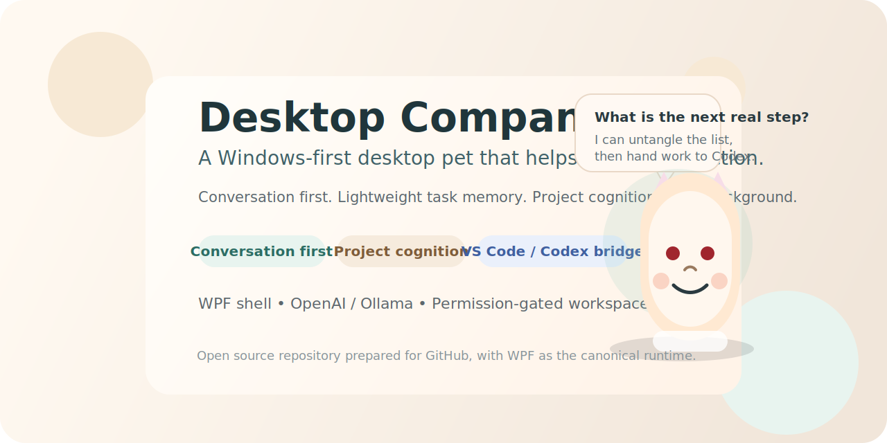
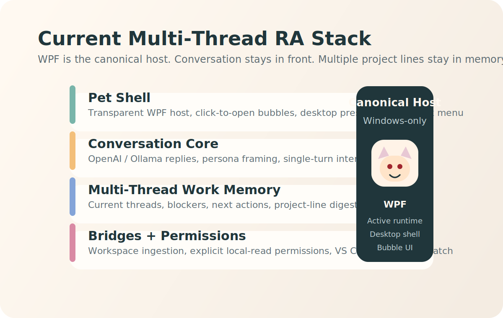

# Desktop Companion

<p align="center">
  
</p>

Desktop Companion is a Windows-first desktop companion for people who run multiple research, engineering, writing, and application threads at the same time.

It combines a desktop-pet interface, conversation-first interaction, lightweight multi-thread memory, and an execution bridge to VS Code / Codex. The goal is not to become another project-management suite, but to help the user keep the right project thread, evidence, blocker, and next step in mind.

The current canonical runtime is a WPF host under `apps/desktop-shell-wpf`. Earlier prototypes are still kept in the repo as references, but they are not the main product path anymore.

## What This Project Is

- A desktop pet that stays on the screen instead of behaving like a normal app window
- A conversation-first RA that can understand multiple task mainlines at the same time
- A lightweight multi-thread work-memory layer, not a full project-management suite
- A local-first assistant that can read project folders only after explicit permission
- A bridge that can hand work to VS Code / Codex and report back in the pet UI

## Current Product Direction

The project is intentionally scoped around one core idea:

> a desktop-resident RA that can hold multiple work threads in mind and help the user move across them

That means:

- conversation comes before task capture
- the system should understand several concurrent mainlines instead of collapsing everything into one to-do list
- work-memory stays lightweight, but it must stay aware of project lines, blockers, and next steps across threads
- project cognition is core capability, not side decoration
- the pet shell matters as much as the reasoning layer

## What The Final Product Should Feel Like

The target product is not a dashboard, a kanban board, or a report generator with a pet skin on top.

The intended end state is:

- a desktop-resident character that feels present even when no large window is open
- a conversation-first interface where the user clicks the pet, says one thing, and gets a useful reply immediately
- an RA that can understand multiple active task mainlines, recognize which items belong to which project thread, and preserve that structure over time
- a reasoning layer that can catch emotion, untangle mixed work items, and reduce each thread into the next real step
- a lightweight memory layer that remembers current threads, blockers, next actions, and project lines without turning into heavy project-management UI
- an optional execution bridge that can read approved project folders, open VS Code, dispatch work to Codex, and report results back through the pet

In short, the final product should feel like:

> a desktop RA that can understand multiple concurrent workstreams, not another productivity dashboard

## Where The Project Is Now

The project is already past the pure-concept stage, but it is not at a polished release yet.

Current state:

- the canonical Windows runtime exists and builds cleanly as a WPF host
- the desktop pet shell, bubble interaction, and character asset are already in place
- OpenAI and Ollama provider paths are wired in
- mixed-list digestion, project-memory, permission gating, and workspace ingestion already exist
- VS Code / Codex bridge exists and can dispatch structured work
- the repo has now been cleaned up for open-source publishing

What is still unfinished:

- the overall UX still needs another round of simplification and visual polish
- some logic is still too concentrated in `MainWindowViewModel`
- legacy prototypes are still present in the repo as references
- there is not yet a stable packaged release flow for end users
- the product still needs a cleaner “first-run to daily-use” path
- the multi-mainline RA model still needs to be made more explicit in the UI and docs

So the project is currently best described as:

> a working WPF-first prototype with real integrations, moving toward a clearer multi-mainline desktop RA alpha

## Current Main Features

- WPF desktop pet host with transparent always-on-top shell
- single-click open/close interaction with bubble-based UI
- OpenAI-backed conversation support
- Ollama-backed local conversation support
- project-memory and multi-thread work models
- project-dump digestion for mixed lists of work items across multiple mainlines
- explicit permission flow before scanning local project folders
- workspace ingestion for `README`, summary docs, notes, code, and selected text assets
- VS Code / Codex bridge for opening a workspace and dispatching structured tasks

## Visual Preview

<p align="center">
  
</p>

<p align="center">
  
</p>

## Repository Layout

```text
.
├─ apps/
│  ├─ desktop-shell/          # legacy Tauri prototype
│  └─ desktop-shell-wpf/      # current canonical Windows host
├─ docs/                      # product, cognition, and architecture docs
├─ packages/                  # earlier TypeScript workspace packages kept for reference
├─ index.html                # earliest static prototype
├─ app.js
└─ styles.css
```

## Canonical Runtime

The active product runtime is:

- `DesktopCompanion.Windows.sln`
- `apps/desktop-shell-wpf/DesktopCompanion.WpfHost.csproj`

The WPF host currently owns:

- pet shell
- bubble UI
- conversation loop
- permissions
- local memory stores
- project cognition
- workspace ingestion
- OpenAI / Ollama providers
- VS Code / Codex bridge

## Legacy Areas

These parts remain in the repo as historical prototypes or reference implementations:

- `apps/desktop-shell` for the Tauri prototype
- `packages/*` for the earlier TypeScript workspace split
- root `index.html`, `app.js`, and `styles.css` for the earliest local prototype

They are useful as reference material, but they are not the current shipping path.

## Getting Started

### Requirements

- Windows
- .NET 8 SDK
- Node.js 20+ and npm
- optional: Ollama running locally on `http://127.0.0.1:11434`
- optional: VS Code and `codex` available on `PATH`

### Build the WPF Host

```powershell
dotnet build DesktopCompanion.Windows.sln
dotnet run --project apps/desktop-shell-wpf/DesktopCompanion.WpfHost.csproj
```

### Optional TypeScript Workspace Checks

```powershell
npm ci
npm run typecheck
```

## Configuration

### OpenAI

Set these environment variables if you want the pet to use OpenAI:

```powershell
$env:OPENAI_API_KEY="your-key"
$env:OPENAI_MODEL="gpt-5"
```

Optional:

```powershell
$env:OPENAI_BASE_URL="https://api.openai.com/v1/"
```

### Ollama

The local provider expects Ollama at:

- `http://127.0.0.1:11434`

The current default model in code is `gemma4:e4b`.

## Privacy and Permissions

- local folder reading is opt-in
- the app asks for permission before scanning project directories
- authorized workspace paths can be cleared from the app
- local memory is stored on the machine, not in the repo

## Documentation

- [Final product structure](./docs/final-product-structure.md)
- [Product positioning](./docs/product-positioning.md)
- [Product principles](./docs/product-principles.md)
- [Project bucket system](./docs/project-bucket-system.md)
- [Repo structure](./docs/repo-structure.md)
- [WPF host route](./docs/wpf-host-route.md)
- [Project cognition](./docs/project-cognition.md)
- [Tuanzi cognition assets](./docs/tuanzi-cognition-assets.md)
- [Work progress distillation report](./docs/work-progress-distillation-report.md)

## References and Inspirations

This project is original, but several open-source projects and technical docs were useful reference points while shaping the current direction.

### Product / interaction references

- [VPet](https://github.com/LorisYounger/VPet)
  - strong reference for WPF-based desktop-pet presence and plugin-oriented desktop pet thinking
- [BongoCat](https://github.com/ayangweb/BongoCat)
  - useful reference for lightweight desktop-pet shell behavior and cross-platform pet interaction ideas
- [ActivityWatch](https://github.com/ActivityWatch/activitywatch)
  - useful reference for privacy-first local activity awareness and the idea of background progress sensing

### Technical references

- [OpenAI Responses API](https://platform.openai.com/docs/api-reference/responses)
  - current OpenAI API reference for the provider path used in this project
- [Ollama Chat API](https://docs.ollama.com/api/chat)
  - local model chat API reference used by the Ollama provider path

### Product framing references

- [Final product structure](./docs/final-product-structure.md)
  - the internal product boundary document for this repository
- [Project cognition](./docs/project-cognition.md)
  - internal notes for how mixed work items are grouped into project lines
- [Tuanzi cognition assets](./docs/tuanzi-cognition-assets.md)
  - internal cognition and persona references used by the companion layer

## Contributing

See [CONTRIBUTING.md](./CONTRIBUTING.md).

## License

This repository is currently prepared with the [MIT License](./LICENSE).
