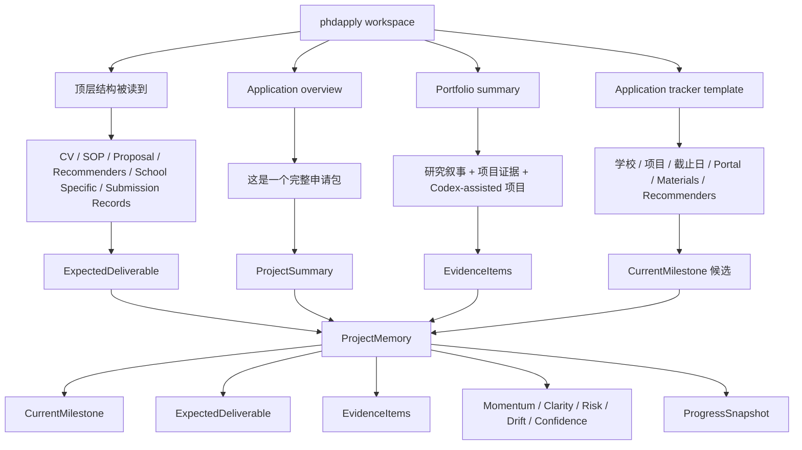

# Project State Example: `phdapply`

这份文档不是理想中的未来状态引擎，而是：

**按当前 `Sprint 1` 已经落地的规则，拿一个真实项目 `C:\Users\austa\OneDrive\Desktop\phdapply` 跑出来，大概会长成什么状态。**

所以它的意义是：

- 看这版状态系统到底“会怎么看项目”
- 看这版分数有哪些地方已经有用
- 看这版分数哪里还会高估或低估

---

## 1. 这次拿来喂状态系统的真实信号

这次示例只基于几份已经读到的本地证据：

- [00_APPLICATION_PACKAGE_OVERVIEW.md](C:/Users/austa/OneDrive/Desktop/phdapply/00_APPLICATION_PACKAGE_OVERVIEW.md:1)
- [00_PROJECT_PORTFOLIO_SUMMARY.md](C:/Users/austa/OneDrive/Desktop/phdapply/00_PROJECT_PORTFOLIO_SUMMARY.md:1)
- [00_application_tracker_template.csv](C:/Users/austa/OneDrive/Desktop/phdapply/00_application_tracker_template.csv:1)
- 顶层目录结构：
  - `01_CV_Resume`
  - `02_Statement_of_Purpose`
  - `03_Research_Proposal`
  - `06_Recommendation_Letters`
  - `08_School_Specific`
  - `09_Submission_Records`

---

## 2. 当前系统会先把它看成什么

如果按现在这版逻辑，它大概率会把 `phdapply` 先理解成：

**一个以 PhD 申请交付为目标的 research-ops 工作区。**

不是：

- 单一研究 repo
- 纯代码仓库
- 单文档写作文件夹

更像：

- 多材料并行推进
- 多学校定制
- 证据和叙事要反复重组
- 最后目标是 submission-ready package

---

## 3. 一张图看它会怎么落成项目状态



---

## 4. 如果按现在这版规则推，它大概会长成这样

下面这份不是硬编码输出，而是**根据当前规则和这批真实文件推出来的 repo-grounded 示例状态**。

```yaml
ProjectName: phdapply
WorkspaceKind: 混合项目目录
PrimaryWorkspacePath: C:\Users\austa\OneDrive\Desktop\phdapply

LikelySummary: >
  A structured PhD application package that organizes CV, SOP, research proposal,
  publications, recommendation logistics, school-specific materials, and submission records.

LikelyCurrentMilestone: >
  把通用申请包收成可针对不同学校复用和定制的 submission-ready bundle

LikelyExpectedDeliverable: application draft

LikelyEvidence:
  - Package overview confirms full folderized application structure
  - Portfolio summary shows research/project evidence already assembled
  - Tracker template shows school/program/deadline/materials/recommenders dimensions
  - Multiple finalized / draft-like artifacts already exist in CV and SOP flow

LikelyBlockers:
  - 当前 Sprint 1 规则下，未必会自动识别出 blocker
  - 因为现有文档里没有很多显式 “blocked / waiting / 不能 / 卡住” 词

LikelyProgressSnapshot:
  StatusLabel: active
  FocusSummary: 收束申请包并推进学校定制
  HealthSummary: Workspace mapped as mixed project directory
```

---

## 5. 这版分数大概会长什么样

如果 `phdapply` 被当前规则识别成主线项目，而且没有显式 blocker，它很可能会被打成下面这种分布：

| Score | Likely Range | Why |
|---|---:|---|
| `Momentum` | `72-84` | 被当作当前主线，而且有很多明确事项 |
| `Clarity` | `85-100` | 目标、材料结构、交付物都很明确 |
| `Risk` | `16-28` | 当前规则缺少真实依赖/截止日风险建模 |
| `Drift` | `14-24` | 当前 deliverable 很清楚，所以 drift 会偏低 |
| `Confidence` | `75-90` | 目录结构和文档证据都很强 |

再画得更直观一点：

```text
Momentum    [#################---] 78
Clarity     [###################-] 92
Risk        [#####---------------] 22
Drift       [####----------------] 18
Confidence  [##################--] 84
```

---

## 6. 这份分数哪里是对的

这版对 `phdapply` 有 3 个地方判断会比较准：

- `Clarity 高`
  - 这是对的，因为这个目录不是散文件，而是明确的申请交付结构。

- `Confidence 高`
  - 这也大致对，因为它不是空聊天，而是读到了真实目录和真实材料。

- `Drift 低`
  - 在当前这个 workspace 层面也基本合理，因为目标很收束，就是申请包本身。

---

## 7. 这份分数哪里会失真

这版最容易失真的地方也很明显：

### `Risk 会被低估`

原因：

- 当前规则几乎没用 deadline
- 没有真实 recommender 进度解析
- 没有 “学校 specific 版本差异” 的压力建模
- 没有 “某份材料看起来成型，但其实没 final” 的判断

也就是说：

**对 `phdapply` 这种项目，真正的人类风险往往比当前系统打出来的更高。**

### `Momentum 可能被高估`

原因：

- 当前规则很奖励“结构完整、材料多、事项多”
- 但这不等于真实推进节奏就很好

如果一个申请包：

- 文件很多
- 结构很全
- 但最近 7 天没有实质推进

现在这版依然可能把 `Momentum` 判高。

### `Blocker 识别太弱`

这是当前版本最大的缺口之一。

对 `phdapply` 来说，真实 blocker 可能是：

- 推荐人还没确认
- 某学校版本没收束
- SOP 还没适配某条研究叙事
- 某些 claim 证据还不够稳

但现在这些不会自动稳定浮出来。

---

## 8. 所以这份示例最值得你看的是什么

不是“分数具体是多少”，而是：

### 这版已经能做到的

- 把真实项目落成结构化状态
- 知道它是个什么类型的工作区
- 推出 milestone / deliverable / evidence / snapshot
- 给出第一版可量化状态

### 这版还做不到的

- 真正按研究申请节奏识别风险
- 真正按跨学校并行状态识别主线压力
- 真正识别隐性 blocker
- 真正判断“材料看起来多，但实际推进并不顺”

---

## 9. 如果下一步专门针对 `phdapply` 这种项目补强

那最该补的不是 UI，而是 4 个状态维度：

1. `DeadlinePressure`
   - 距离最近学校 deadline 还有多久

2. `ApplicationCompleteness`
   - CV / SOP / Proposal / Letters / Submission records 各自完成度

3. `SchoolSpecificReadiness`
   - 学校定制材料到底成型了几所

4. `EvidenceStability`
   - 这份叙事后面的 claim 有多少是稳的、有多少还只是候选表述

这 4 个一补，`phdapply` 这种项目的状态系统就会比现在强一个量级。

---

## 10. 一句话总结

如果现在这版桌宠去看 `phdapply`，它大概率会得出一个：

**“结构清晰、目标明确、证据丰富、但风险被低估的申请运营项目”**

这其实已经说明 `Sprint 1` 地基是对的。  
下一步不是重做，而是把 `risk / blocker / deadline / school-specific readiness` 这些真实压力维度接进去。
