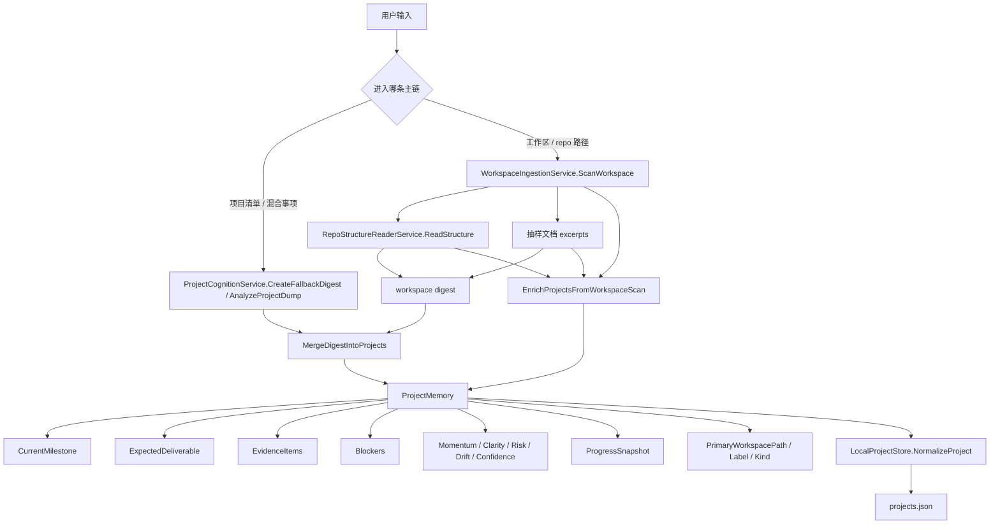

# Project State Visualization

这份文档回答一个问题：

**现在这版桌宠里，`ProjectMemory` 的状态到底是怎么被算出来的？**

先说结论：

- 这还是 `Sprint 1` 的第一版状态引擎
- 目前不是学习型评分器，而是 `heuristic state model`
- 它已经能把“聊天理解”和“工作区读取”都落到结构化项目状态上
- 但分数现在还是规则驱动，不是最终版 `ProjectStateScorer`

---

## 1. 一张图看全链路



---

## 2. 现在的状态来源分 3 层

### `Layer 1: 存储归一化层`

这是 [LocalProjectStore.cs](C:/Users/austa/OneDrive/Desktop/mainland/apps/desktop-shell-wpf/Services/LocalProjectStore.cs:69) 做的事。

职责：

- 给旧项目补缺失字段
- 兼容老版 `projects.json`
- 在没有新证据时，给项目推一版基础分

它更像：

**baseline normalization**

不是强判断，只是保证任何项目对象都不是空壳。

---

### `Layer 2: 项目 digest 合并层`

这是 [ProjectCognitionService.cs](C:/Users/austa/OneDrive/Desktop/mainland/apps/desktop-shell-wpf/Services/ProjectCognitionService.cs:173) 往下那段做的事。

职责：

- 把项目清单归并成 `ProjectDigestProject`
- 把 `summary / next action / keywords / items` 写回 `ProjectMemory`
- 同时推一版 milestone、deliverable、blocker、evidence 和 heuristic scores

它更像：

**从“你刚刚说了什么”推项目状态**

---

### `Layer 3: 工作区增强层`

这是 [MainWindowViewModel.cs](C:/Users/austa/OneDrive/Desktop/mainland/apps/desktop-shell-wpf/ViewModels/MainWindowViewModel.cs:1800) 之后这一层做的事。

职责：

- 把 workspace path 写回项目
- 把 repo structure 变成 evidence
- 把 sampled documents 变成 evidence
- 如果有结构信号，就抬高部分分数下限

它更像：

**从“我真的读过这个 repo / 目录”补强项目状态**

---

## 3. `ProjectMemory` 现在有哪些关键状态

对应 [ProjectMemory.cs](C:/Users/austa/OneDrive/Desktop/mainland/apps/desktop-shell-wpf/Models/ProjectMemory.cs:3)：

- `CurrentMilestone`
  - 当前这条项目线正在打的最近一层目标
- `ExpectedDeliverable`
  - 这条线现在更像要产出什么
- `PrimaryWorkspacePath`
  - 当前主要绑定的本地工作区
- `WorkspaceKindLabel`
  - 它更像哪类 repo / 工作区
- `EvidenceItems`
  - 最近证据
- `Blockers`
  - 当前阻塞
- `MomentumScore`
  - 推进势能
- `ClarityScore`
  - 目标和下一步清不清
- `RiskScore`
  - 当前卡点和不确定性有多高
- `DriftScore`
  - 有没有跑偏
- `ConfidenceScore`
  - 当前判断基于多少真实信号
- `ProgressSnapshot`
  - 给 UI / persona 的轻量状态摘要

---

## 4. 现在这版分数怎么来的

## 4.1 Baseline normalization 分数

来自 [LocalProjectStore.cs](C:/Users/austa/OneDrive/Desktop/mainland/apps/desktop-shell-wpf/Services/LocalProjectStore.cs:179) 到 [LocalProjectStore.cs](C:/Users/austa/OneDrive/Desktop/mainland/apps/desktop-shell-wpf/Services/LocalProjectStore.cs:265)。

### `Momentum`

```text
20
+ 有 NextAction => +20
+ RecentItems 每条 +5，最多 +20
- 有 Blocker => -15
```

### `Clarity`

```text
15
+ 有 Summary => +20
+ 有 CurrentMilestone => +20
+ 有 ExpectedDeliverable => +20
+ Keywords >= 3 => +10
```

### `Risk`

```text
20
+ 1 个 Blocker => +20
+ 2 个及以上 Blocker => +35
+ 没有 NextAction => +10
```

### `Drift`

```text
有 ExpectedDeliverable => 15
没有 ExpectedDeliverable => 28
+ RecentItems > 3 且没有 CurrentMilestone => +12
```

### `Confidence`

```text
20
+ 有 Summary => +15
+ EvidenceItems 每条 +5，最多 +25
+ Keywords 每条 +4，最多 +20
```

这一层不是“真判断”，只是旧数据兜底。

---

## 4.2 Project digest 分数

来自 [ProjectCognitionService.cs](C:/Users/austa/OneDrive/Desktop/mainland/apps/desktop-shell-wpf/Services/ProjectCognitionService.cs:408) 往下。

### `MomentumScore`

```text
priority = now   => 72
priority = next  => 56
priority = later => 38

+ items.count * 4，最多 +12
- 1 blocker  => -12
- 2+ blocker => -22
```

解释：

- `now` 说明它被排成当前主线，所以默认势能高
- blocker 会直接拉低 momentum

### `ClarityScore`

```text
18
+ 有 Summary => +18
+ 有 NextAction => +18
+ 有 CurrentMilestone => +18
+ 有 ExpectedDeliverable => +18
+ keywords.count * 3，最多 +12
```

解释：

- 这版 clarity 看的是“目标、下一步、产出、语义锚点”是否成型

### `RiskScore`

```text
16
+ 1 blocker  => +25
+ 2+ blocker => +42
+ 没有 NextAction => +12
+ priority = now 且有 blocker => +8
```

解释：

- “现在要推的线”如果还有 blocker，会被额外判高风险

### `DriftScore`

```text
priority = later => 34
否则 => 14

+ 没有 ExpectedDeliverable => +12
+ items >= 4 且没有 NextAction => +10
```

解释：

- 被排到 `later` 的线，天然更像已经开始漂远
- 事项很多但没有下一步，也很像在散

### `ConfidenceScore`

```text
24
+ 有 Summary => +15
+ items.count * 7，最多 +28
+ keywords.count * 4，最多 +20
```

解释：

- 这版 confidence 还主要看“digest 本身信息量够不够”
- 后面应该升级成真正的 evidence-based confidence

---

## 4.3 Workspace enrichment 对状态的影响

来自 [MainWindowViewModel.cs](C:/Users/austa/OneDrive/Desktop/mainland/apps/desktop-shell-wpf/ViewModels/MainWindowViewModel.cs:1800) 往下。

这层不重算所有分数，而是做 **evidence-backed uplift**：

### 写入内容

- `PrimaryWorkspacePath`
- `PrimaryWorkspaceLabel`
- `WorkspaceKindLabel`
- `EvidenceItems += workspace scan / repo structure / workspace docs`
- `LastEvidenceAt = now`
- `LastMeaningfulProgressAt = now`

### 分数抬升规则

```text
ClarityScore >= 58   （有 repo structure）
ClarityScore >= 48   （只有 workspace scan）

ConfidenceScore >= 62 （有 repo structure）
ConfidenceScore >= 50 （只有 workspace scan）

MomentumScore >= 52
```

解释：

- 一旦它真的读过 repo，`clarity` 和 `confidence` 的下限就应该高于纯聊天
- 但这不是最终版 scorer，只是“读过真实工作区”的 first-pass reward

---

## 5. 证据是怎么进来的

现在的 `EvidenceItems` 主要来自 2 类：

### `project-digest evidence`

来自 [ProjectCognitionService.cs](C:/Users/austa/OneDrive/Desktop/mainland/apps/desktop-shell-wpf/Services/ProjectCognitionService.cs:480)。

会写入：

- project summary
- project items

特点：

- 偏语言理解层
- 还不是硬 repo evidence

### `workspace evidence`

来自 [MainWindowViewModel.cs](C:/Users/austa/OneDrive/Desktop/mainland/apps/desktop-shell-wpf/ViewModels/MainWindowViewModel.cs:1887)。

会写入：

- `workspace-scan`
- `repo-structure`
- `workspace-docs`

特点：

- 这部分是真正贴近本地文件系统的 evidence
- 也是后面 `Sprint 2` 最该继续扩的地方

---

## 6. 现在这版最重要的限制

这版已经不是空壳了，但它还远没到终局。

### 还没有做到的地方

- `Momentum` 还不是真正基于时间序列证据
- `Risk` 还没有 owner / dependency / overdue 维度
- `Drift` 还没有“当前动作 vs 项目目标”的真实对齐判断
- `Confidence` 还没有按 evidence source quality 区分
- `Workspace evidence` 还没有独立 collector service

所以这版应该理解成：

**已经有了可落盘、可继续演进的项目状态骨架。**

不是：

**已经有了成熟的评分引擎。**

---

## 7. 下一步最该怎么进

如果顺着这张图往下做，下一步最对的是：

### `Sprint 2`

补两个真正的 service：

- `ProjectEvidenceCollectorService`
- `ProjectStateScorer`

新的职责切法应该是：

- `ProjectCognitionService`
  - 负责理解和归并
- `ProjectEvidenceCollectorService`
  - 负责采证和去重
- `ProjectStateScorer`
  - 负责统一算分
- `ProjectReviewEngine`
  - 负责决定什么时候主动 review

也就是说：

**现在的 heuristic score 应该从 `ProjectCognitionService + MainWindowViewModel` 里逐步抽出去。**

这才会变成真正稳定的状态系统。
